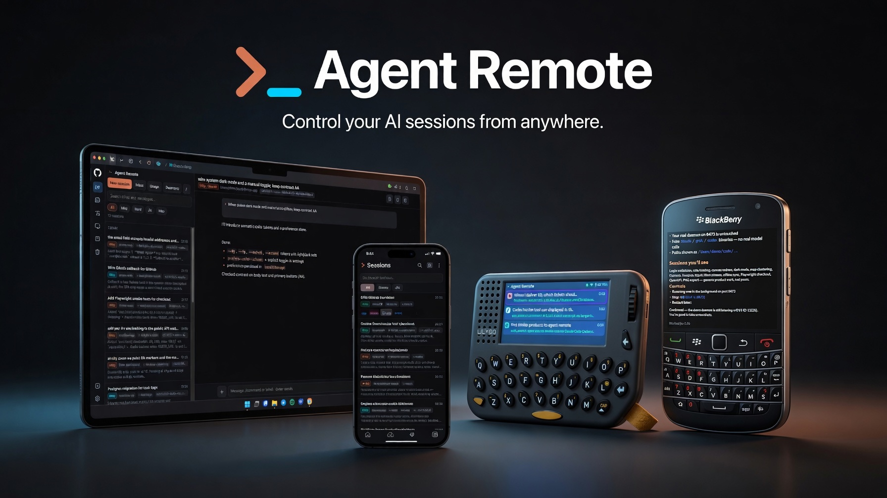

<h1 align="center">
  
  Agent Remote
</h1>

<p align="center">
  Control your AI sessions from anywhere.<br>
  <strong>One list across every machine.</strong> Self-hosted. No token resale.
</p>

<p align="center">
  <a href="https://github.com/jxw1102/agent-remote/releases"></a>
  <a href="LICENSE"></a>
  <a href="https://github.com/jxw1102/agent-remote/actions/workflows/release.yml"></a>
</p>

<p align="center">
  
</p>

Start, watch, and steer Claude Code, Grok, Codex, and DeepSeek from your
phone or browser — even when you are away from the desk. A small daemon on your Mac or
VPS talks to the CLIs you already use. Clients merge every host into **one
list**.

## Get started

You need **Python 3** and at least one working CLI on the machine you install
on: `claude`, `grok`, `codex`, and/or `dsh` (DeepSeek Harness) — subscription
login or API key. Confirm the CLI works in a normal terminal first.

### 1. Install the daemon

One command. No clone required.

```bash
curl -fsSL https://raw.githubusercontent.com/jxw1102/agent-remote/main/install.sh | bash
```

It prints a **Base URL** and **token**. On macOS it installs a launchd service;
on Linux, a user systemd unit.

**Or hand this to your coding agent.** Paste into Claude, Codex, Grok, or Cursor
(no clone needed):

```text
Follow https://raw.githubusercontent.com/jxw1102/agent-remote/main/docs/AGENT_INSTALL.md
and install the Agent Remote daemon on this machine.
Print the Base URL and token when done.
```

Brief: [docs/AGENT_INSTALL.md](https://github.com/jxw1102/agent-remote/blob/main/docs/AGENT_INSTALL.md)

### 2. Connect a client

| Setting | Value |
| --- | --- |
| Base URL | `http://127.0.0.1:8473` on the same machine, or a LAN / Tailscale / tunnel URL |
| Token | printed by the installer, also in `~/.agentremoted/token` |

- **Web (easiest):** [hosted client](https://nice-dune-0415af003.7.azurestaticapps.net/) → **Add a daemon**. It talks only to **your** machines.
- **Android / iOS / BlackBerry 10:** install from [Releases](https://github.com/jxw1102/agent-remote/releases), then add the same URL + token.
- **Pebble Time 2:** build [`pebble/`](pebble/) and paste the same URL + token in the official Pebble app settings.

Same Wi‑Fi: use `http://<laptop-lan-ip>:8473`. For a phone off your network, use a tunnel (next).

### 3. Use it from your phone

Do **not** expose port 8473 on the public internet.

```bash
# after the daemon is running
cloudflared tunnel --url http://localhost:8473
```

Use the printed `https://….trycloudflare.com` URL as the client Base URL. The
daemon token still authenticates every request.

Need a helper script from a clone: `daemon/scripts/tunnel.sh`. For a stable
hostname, use a named Cloudflare tunnel or Tailscale. Step-by-step smoke path:
[docs/getting-started.md](docs/getting-started.md).

### 4. Start a session

1. **New session**
2. Pick the host if you have more than one profile
3. Pick the provider if that host runs more than one CLI
4. Send a prompt

You should see live status, permission prompts, and questions — the same
sessions that exist on the host.

A second machine is the same install again. Add another profile; both hosts
show up in one list.

## Update

When a [new version](https://github.com/jxw1102/agent-remote/releases) ships,
run the **same** install command again on each machine that has the daemon:

```bash
curl -fsSL https://raw.githubusercontent.com/jxw1102/agent-remote/main/install.sh | bash
```

Your token and `~/.agentremoted/config.json` stay put. The script replaces
the daemon code and restarts the service.

Check the version after: open a client, or
`curl -s http://127.0.0.1:8473/api/ping` and look at `"version"`.

| Piece | How to update |
| --- | --- |
| Daemon | Re-run the curl above (every host) |
| Hosted web client | Nothing — it is already the latest |
| Android / iOS / BlackBerry | Install the new APK / BAR from [Releases](https://github.com/jxw1102/agent-remote/releases) |

Or paste this to your coding agent:

```text
Follow https://raw.githubusercontent.com/jxw1102/agent-remote/main/docs/AGENT_INSTALL.md
and update the Agent Remote daemon on this machine to the latest release.
Keep the existing token and config. Print the Base URL, token, and new version when done.
```

## You already pay the model. Not us.

Agent Remote **does not** bill usage and **does not** need its own
Anthropic / OpenAI / xAI account.

| You already pay | What Agent Remote uses |
|-----------------|------------------------|
| Claude Pro/Max (or API key) | Host `claude` CLI login / env |
| ChatGPT / Codex (or API key) | Host `codex` CLI |
| xAI / Grok | Host `grok` CLI |
| DeepSeek (or API key) | Host `dsh` harness |
| Nothing extra for AR | Only a local daemon **token** for clients |

Log into each CLI **on the host** once. Clients only store the daemon URL +
token. If both a Claude subscription and `ANTHROPIC_API_KEY` are present, the
CLI bills the **API key** — unset the key to stay on Max. Full notes:
[docs/billing-and-auth.md](docs/billing-and-auth.md).

## Clients

| Client | Location | Intended use |
| --- | --- | --- |
| Web | [`web/`](web/) · [hosted client](https://nice-dune-0415af003.7.azurestaticapps.net/) | Browser; no build step — or just open the hosted page |
| Android | [`android/`](android/) | Full mobile client + notifications |
| iOS | [`ios/`](ios/) | SwiftUI app for iPhone + iPad |
| BlackBerry 10 | [`blackberry/`](blackberry/) | Cascades app for BB10 devices |
| LILYGO T-LoRa Pager | [`esp32/`](esp32/) | Small-screen, keyboard-driven remote |
| Pebble Time 2 | [`pebble/`](pebble/) | Native emery watchapp; voice + buttons |

## Why Agent Remote?

- **Multi-host session home** — several daemons, one client list sorted by activity.
- **Keeps subscription economics** — runs official CLIs; Pro/Max and ChatGPT logins stay on the host (API keys work too).
- **Agent-aware remote** — permissions, AskUserQuestion, queue, stop, live TUI, rewind — not a dumb terminal proxy.
- **Ultra-light daemon** — Python standard library only; launchd / systemd / one-shot install.
- **Unusual clients** — BlackBerry 10 Cascades, Pebble Time 2, and LILYGO T-LoRa Pager alongside web, Android, and iOS.

```text
  Phone / web / BB10 / pager
            │  profiles (Mac, VPS, …)
            ▼
     ┌──────────────┐     ┌──────────────┐
     │ agentremoted │     │ agentremoted │
     │   Mac · Max  │     │  VPS · Grok  │
     └──────┬───────┘     └──────┬───────┘
            │                    │
       claude / codex          grok
```

## Features

- Multi-host profiles and multi-agent sessions (Claude · Grok · Codex · DeepSeek)
- Live status (SSE / WebSocket), queues, stop, capability discovery (`GET /api/ping`)
- Auth / login health on `/api/ping` (daemon ≥ 2.5.3)
- Focus mode: filter the list to the projects you are carrying, tagged *needs
  answer · failed · working · turn finished*; rename or re-derive session titles
- Share a session: web, Android, and BlackBerry mint a 7-day read-only URL
  hosted by the daemon (`/share/<token>`). LILYGO does not generate links.
- Permission Allow/Deny and `AskUserQuestion` where the harness supports them
- Attachments, slash commands, host→device file drop, session rewind
- Interactive and headless execution modes

## Security

- Every API request (except unauthenticated `/api/ping`) needs the daemon token.
- Keep the token private; rotate if exposed.
- Prefer private LAN, Tailscale, or HTTPS tunnel.
- [SECURITY.md](SECURITY.md)

## Manual install and development

```bash
mkdir -p ~/.agentremoted
cp deploy/config.example.json ~/.agentremoted/config.json
# providers: ["claude","grok","codex","deepseek"] — trim to CLIs on PATH
cd daemon && PYTHONPATH=. python3 -m agentremoted
curl -s http://127.0.0.1:8473/api/ping
```

macOS service: `daemon/scripts/install-launchd.sh`
Linux VPS: [`deploy/deploy.sh`](deploy/deploy.sh)
Details: [daemon/README.md](daemon/README.md)

```bash
cd daemon
python3 tests/smoke_test.py
python3 tests/render_test.py
```

BlackBerry BAR: `cd blackberry && ./build-bar-docker.sh`
Android: `cd android && ./gradlew assembleDebug` (JDK 17+, platform 36)

## Documentation

- [Getting started (laptop → phone)](docs/getting-started.md)
- [Update to a new version](docs/getting-started.md#7-update-when-a-new-version-ships)
- [Agent-facing install brief](docs/AGENT_INSTALL.md)
- [Billing and auth](docs/billing-and-auth.md)
- [Remote access notes](docs/remote-access.md)
- [Daemon setup and API](daemon/README.md)
- [Android](android/README.md) · [ESP32](esp32/README.md) · [Deploy](deploy/README.md)
- [Contributing](CONTRIBUTING.md) · [Security](SECURITY.md)

## Releases

APK, BAR, single-file web HTML, and packaged daemon builds:
[GitHub Releases](https://github.com/jxw1102/agent-remote/releases). Tags match
the daemon version (e.g. `v2.5.3`).

## License

Agent Remote is released under the [MIT License](LICENSE).
